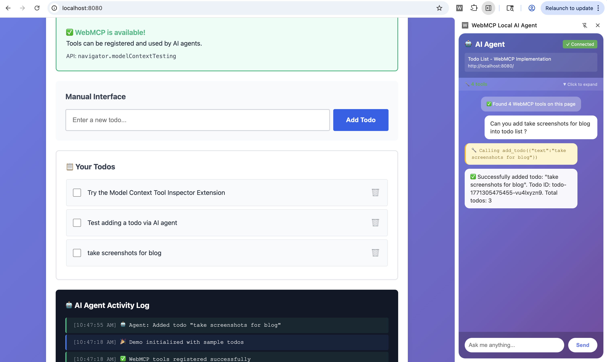
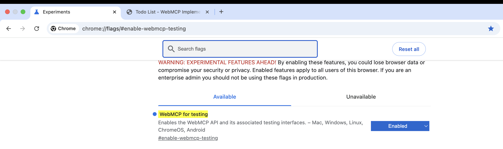
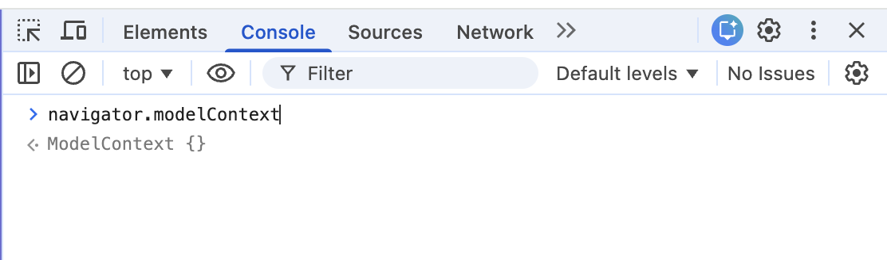
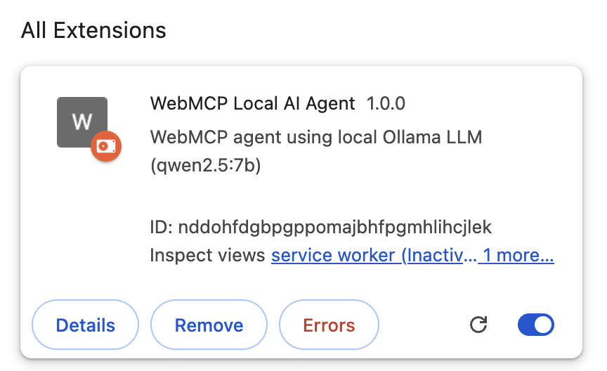
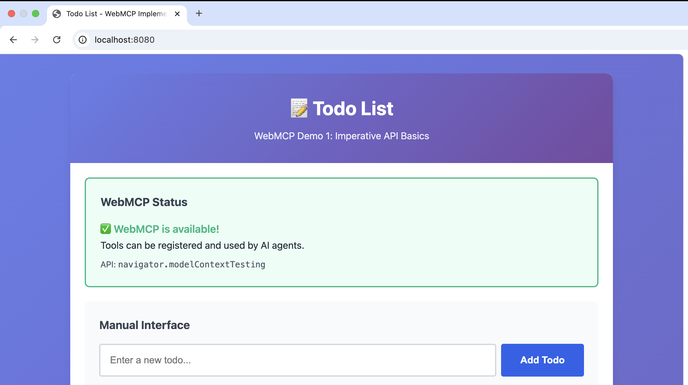
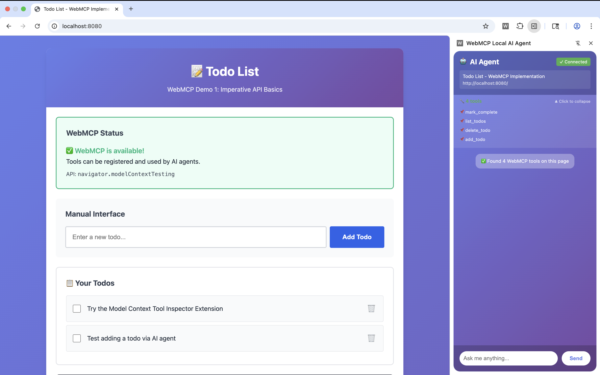
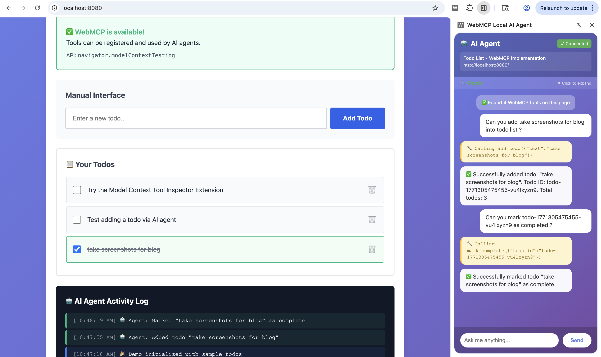

# WebMCP Implementation

A complete implementation of **WebMCP** (Web Model Context Protocol) - Chrome's new standard for AI-ready websites.


*Complete end-to-end demo: AI agent interacting with todo list using WebMCP tools*

## What is This Project?

This project provides practical, real-world examples of **BOTH SIDES** of WebMCP:

1. **Frontend Developer Side** - How to expose tools on websites
2. **AI Developer Side** - How to build Chrome extensions that use those tools

**Complete end-to-end demonstration with local LLM integration (Ollama)!**

## 🚀 Quick Start (5 Minutes Setup)

### Step 1: Setup Chrome (2 minutes)

**A. Install Chrome Canary**
1. Download from: https://www.google.com/chrome/canary/
2. Install for your operating system
3. Open Chrome Canary

**B. Enable WebMCP Flag**
1. In Chrome Canary, go to: `chrome://flags/#enable-webmcp-testing`
2. Find "WebMCP for testing" flag
3. Click dropdown → Select **"Enabled"**
4. Click **"Relaunch"** button at bottom


*Chrome flags page showing WebMCP for testing flag enabled*

**C. Verify Setup**
1. Open DevTools (F12 or Right-click → Inspect)
2. In Console, type: `navigator.modelContext`
3. You should see: `{registerTool: ƒ, unregisterTool: ƒ, ...}` ✅


*DevTools console showing navigator.modelContext API is available*

### Step 2: Clone & Navigate to Project
```bash
# Clone this repository (if not already done)
git clone https://github.com/jageenshukla/webmcp-ollama-chrome-demo
cd webmcp-implementation
```

### Step 3: Start the Demo Website (30 seconds)
```bash
cd demos
python3 -m http.server 8080
```

✅ **Server running at:** http://localhost:8080

> **Keep this terminal open!** The server needs to stay running.

### Step 4: Install Chrome Extension (1 minute)

**A. Open Extensions Page**
1. In Chrome Canary, go to: `chrome://extensions/`
2. Or click: Menu (⋮) → Extensions → Manage Extensions

**B. Enable Developer Mode**
1. Toggle **"Developer mode"** switch in top-right corner
2. You'll see: "Load unpacked", "Pack extension", "Update" buttons appear

**C. Load the Extension**
1. Click **"Load unpacked"** button
2. Navigate to your project folder
3. Select the **`extension-demo/`** folder (the folder containing `manifest.json`)
4. Click **"Select"** or **"Open"**

**D. Verify Installation**
✅ You should see:
- Extension card titled "WebMCP Local AI Agent"
- Extension icon in toolbar
- No error messages (red text)


*Chrome extensions page showing WebMCP Local AI Agent successfully loaded*

> **Tip:** Pin the extension to toolbar: Click puzzle icon → Click pin next to "WebMCP Local AI Agent"

### Step 5: Setup Ollama (Local LLM) (2 minutes)

**A. Install Ollama**
```bash
# macOS/Linux
curl -fsSL https://ollama.ai/install.sh | sh

# Or download from: https://ollama.ai
```

**B. Download Model**
```bash
ollama pull qwen2.5:7b
```
> **Note:** This downloads ~4.7GB. Takes 2-5 minutes depending on internet speed.

**C. Start Ollama Server (with CORS enabled)**

⚠️ **IMPORTANT:** This step is **REQUIRED** for Chrome extensions to work!

```bash
OLLAMA_ORIGINS="chrome-extension://*,http://localhost:*,http://127.0.0.1:*" \
OLLAMA_HOST=0.0.0.0:11434 ollama serve
```

✅ **Ollama running at:** http://localhost:11434

> **Keep this terminal open too!** Ollama needs to stay running.

**Why `OLLAMA_ORIGINS` is required:**
- Chrome extensions have special origins like `chrome-extension://abc123...`
- By default, Ollama blocks requests from extensions (CORS security)
- `OLLAMA_ORIGINS="chrome-extension://*"` allows our extension to connect
- Without this, you'll see CORS errors and the extension won't work!

**If you forget this step:**
- Extension will show: ❌ "Failed to connect to Ollama"
- DevTools will show: `blocked by CORS policy`
- Solution: Stop Ollama and restart with the OLLAMA_ORIGINS variable

### Step 6: Test the Demo! 🎉

**A. Open the Demo Website**
1. In Chrome Canary, navigate to: http://localhost:8080
2. You should see: "📝 Todo List" page


*Todo list web application with WebMCP tools registered*

**B. Open the AI Agent Side Panel**
1. Click the **extension icon** in toolbar (or puzzle icon → WebMCP Local AI Agent)
2. Side panel opens on the right
3. You should see:
   - 🔧 Tools indicator showing "4 tools"
   - Chat interface at bottom


*Extension side panel showing 4 WebMCP tools discovered on the page*

**C. Try These Commands!**
```
You: "add buy milk to my todos"
Agent: ✅ Successfully added: "buy milk"

You: "add three todos: finish report, call dentist, and water plants"
Agent: ✅ Added 3 todos!

You: "show me all my todos"
Agent: 📋 You have 4 todos: ...

You: "mark the first todo as complete"
Agent: ✅ Marked complete!

You: "delete the todo about milk"
Agent: ✅ Deleted!
```

**D. Watch the Magic!**
- AI understands natural language
- Discovers WebMCP tools automatically
- Executes multiple tools in sequence
- Updates the webpage in real-time
- All running locally (no cloud APIs!)


*AI agent executing tools in real-time: adding and managing todos via natural language*

---

## 🆘 Troubleshooting

### Extension not loading?
- ✅ Make sure you selected the **`extension-demo/`** folder (not a subfolder)
- ✅ Check that `manifest.json` exists in selected folder
- ✅ Look for red error text on extension card

### Tools not discovered?
- ✅ Verify WebMCP flag is enabled: `chrome://flags/#enable-webmcp-testing`
- ✅ Check DevTools console for errors
- ✅ Make sure you're using Chrome Canary 146+

### Ollama connection failed?
- ✅ Verify Ollama is running: http://localhost:11434
- ✅ Check CORS environment variables are set
- ✅ Restart Ollama with correct CORS settings

### Side panel not opening?
- ✅ Pin extension to toolbar first
- ✅ Click the extension icon (not the puzzle icon)
- ✅ Check for errors in DevTools

### Need more help?
- 📖 Read [extension-demo/SETUP.md](extension-demo/SETUP.md) for detailed troubleshooting
- 💬 Check Chrome AI Dev Preview [Discussion Group](https://groups.google.com/a/chromium.org/g/chrome-ai-dev-preview-discuss/)

## 📁 Project Structure

```
webmcp-implementation/
├── demos/                  # Website with WebMCP tools
│   ├── index.html         # Todo list UI
│   ├── script.js          # WebMCP tool registration
│   ├── styles.css         # Styling
│   └── README.md          # Demo documentation
│
├── extension-demo/        # Chrome extension (AI agent)
│   ├── manifest.json     # Extension config
│   ├── content.js        # Tool discovery & execution
│   ├── sidepanel.js      # LLM integration (Ollama)
│   ├── sidepanel.html    # Chat UI
│   ├── background.js     # Extension lifecycle
│   └── README.md         # Extension documentation
│
└── docs/                  # Blog posts & guides
    ├── BLOG-1-CONCEPTUAL.md      # Introduction blog
    ├── BLOG-2-TECHNICAL.md       # Technical blog
    ├── BLOG-GUIDE.md             # Blog writing guide
    └── WEBMCP-ECOSYSTEM.md       # Architecture docs
```


*System architecture: How the web page, extension, and Ollama work together*

## 📚 Documentation

### For Readers
- **[BLOG-1-CONCEPTUAL.md](docs/BLOG-1-CONCEPTUAL.md)** - What is WebMCP? (No code, concepts only)
- **[BLOG-2-TECHNICAL.md](docs/BLOG-2-TECHNICAL.md)** - Building WebMCP tools (Complete code)

### For Developers
- **[demos/README.md](demos/README.md)** - Todo list demo documentation
- **[extension-demo/README.md](extension-demo/README.md)** - Extension documentation
- **[extension-demo/SETUP.md](extension-demo/SETUP.md)** - Detailed setup guide

### For Writers
- **[docs/BLOG-GUIDE.md](docs/BLOG-GUIDE.md)** - Guide for writing about WebMCP
- **[docs/WEBMCP-ECOSYSTEM.md](docs/WEBMCP-ECOSYSTEM.md)** - Understanding the ecosystem

## ✨ What's Built

### Todo List Website (Frontend)
Exposes 4 WebMCP tools:
- ✅ `add_todo` - Create new todo items
- ✅ `list_todos` - Get all todos with status
- ✅ `mark_complete` - Mark todo as done
- ✅ `delete_todo` - Remove a todo

### Chrome Extension (AI Agent)
- ✅ Discovers WebMCP tools on any page
- ✅ Uses **local Ollama** LLM (qwen2.5:7b)
- ✅ Natural language interface
- ✅ 100% privacy-first (no cloud APIs)
- ✅ No API keys needed

### Key Features
- 🎯 **100% Official WebMCP APIs** - No workarounds
- 🔒 **Privacy-First** - Everything runs locally
- 💰 **Free** - No API costs
- 📖 **Complete Docs** - Blog posts, READMEs, guides

## 🔧 Requirements

- **Chrome:** Version 146+ (Canary or Dev channel)
- **Flag:** `chrome://flags/#enable-webmcp-testing` enabled
- **Ollama:** Installed and running
- **Model:** qwen2.5:7b (or any model with function calling)

## 🎯 Use Cases

### Example Commands
```
"add three todos: finish report, call dentist, and water plants"
"show me all my todos"
"mark the first todo as complete"
"delete the todo about groceries"
```

### What Makes This Unique?
- **Official Extension** (Model Context Tool Inspector): Requires Gemini API, cloud-based
- **Our Extension**: Uses local Ollama, privacy-focused, no API keys

## 📖 Learning Path

### Week 1: Understand WebMCP
1. Read [BLOG-1-CONCEPTUAL.md](docs/BLOG-1-CONCEPTUAL.md)
2. Try official Chrome demos
3. Enable WebMCP flag in Chrome

### Week 2: Build Your First Tool
1. Read [BLOG-2-TECHNICAL.md](docs/BLOG-2-TECHNICAL.md)
2. Clone this repo and run the demo
3. Modify the todo list tools
4. Add a new tool

### Week 3: Build an Agent
1. Study `extension-demo/content.js`
2. Understand tool discovery and execution
3. Try different Ollama models
4. Customize the side panel UI

### Week 4: Go Further
1. Add more WebMCP tools
2. Test with other websites
3. Optimize prompts for your LLM
4. Share your implementation!

## 🤝 Contributing

This is a learning project! Feel free to:
- Fork and experiment
- Report issues
- Share improvements
- Create tutorials

## 📝 License

MIT License - Feel free to use for learning and building!

## 🔗 Resources

### Official
- [Chrome WebMCP Blog](https://developer.chrome.com/blog/webmcp-epp)
- [WebMCP Specification](https://github.com/webmachinelearning/webmcp)
- [Early Preview Program](https://developer.chrome.com/docs/ai/join-epp)
- [Discussion Group](https://groups.google.com/a/chromium.org/g/chrome-ai-dev-preview-discuss/)

### Tools
- [Ollama](https://ollama.ai) - Local LLM runtime
- [Model Context Tool Inspector](https://chromewebstore.google.com/detail/model-context-tool-inspec/gbpdfapgefenggkahomfgkhfehlcenpd) - Official Chrome extension

### Community
- File bugs: https://crbug.com/new?component=2021259
- Questions: Chrome AI Dev Preview Discussion Group

---

**Built with 100% official WebMCP APIs | Local LLM with Ollama | Privacy-first AI**
